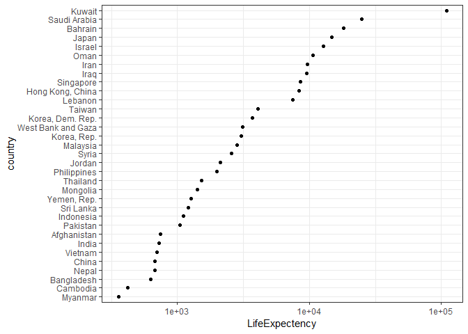
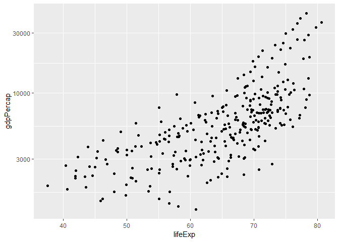
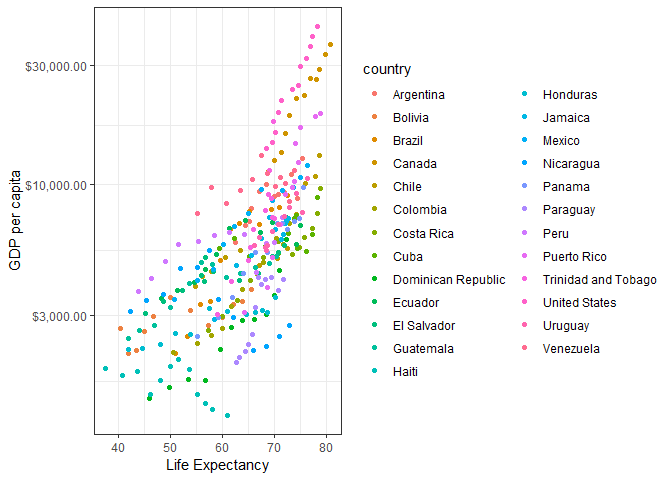

STAT 545A Homework 5
================
Tian Gao
2018/9/27

# Bring rectangular data in

``` r
## load gapminder
suppressPackageStartupMessages(library(gapminder))
## load tidyverse
suppressPackageStartupMessages(library(tidyverse))
## load forcats
suppressPackageStartupMessages(library(forcats))
## load plotly
suppressPackageStartupMessages(library(plotly))
suppressPackageStartupMessages(library(dplyr))
suppressPackageStartupMessages(library(tidyverse))
library(gapminder)
library(knitr)
suppressPackageStartupMessages(library(scales))
suppressPackageStartupMessages(library(plotly))
```

# Part 1: Factor management

  - Elaboration for the gapminder data set

  - Drop Oceania. Filter the Gapminder data to remove observations
    associated with the continent of Oceania. Additionally, remove
    unused factor levels. Provide concrete information on the data
    before and after removing these rows and Oceania; address the number
    of rows and the levels of the affected factors.

  - First let’s see the levels of gapminder.

<!-- end list -->

``` r
levels(gapminder$continent)
```

    ## [1] "Africa"   "Americas" "Asia"     "Europe"   "Oceania"

  - Then I’ll show the rows of a gapminder

<!-- end list -->

``` r
nrow(gapminder) 
```

    ## [1] 1704

  - Then let’s drop Ocania

<!-- end list -->

``` r
drop <- gapminder %>% 
  filter(continent %in%  c("Europe", "Africa", "Asia", "Americas"))
levels(drop$continent)
```

    ## [1] "Africa"   "Americas" "Asia"     "Europe"   "Oceania"

  - We can see that the continent of Oceania is unchanged. To fix this
    we need to use droplevels()

<!-- end list -->

``` r
dropped <- drop %>%
  droplevels()

levels(dropped$continent)
```

    ## [1] "Africa"   "Americas" "Asia"     "Europe"

  - Then I’ll address the number of rows and the levels of continent
    before and after removing Oceania.

<!-- end list -->

``` r
# before 
nrow(gapminder)
```

    ## [1] 1704

``` r
nlevels(gapminder$continent)
```

    ## [1] 5

``` r
# after
nrow(dropped)
```

    ## [1] 1680

``` r
nlevels(dropped$continent)
```

    ## [1] 4

  - From the above discussion, we can see that the number of rows before
    dropping Oceania is 1704 and the continent level is 5, the number of
    rows after dropping oceania is 1680 and continent level is 4.

  - Reorder the levels of country or continent. Use the forcats package
    to change the order of the factor levels, based on a principled
    summary of one of the quantitative variables. Consider experimenting
    with a summary statistic beyond the most basic choice of the median.

  - First of all let’s show the dropped gapminder

<!-- end list -->

``` r
dropped %>%
  head(15) %>%
  knitr::kable()
```

| country     | continent | year | lifeExp |      pop | gdpPercap |
| :---------- | :-------- | ---: | ------: | -------: | --------: |
| Afghanistan | Asia      | 1952 |  28.801 |  8425333 |  779.4453 |
| Afghanistan | Asia      | 1957 |  30.332 |  9240934 |  820.8530 |
| Afghanistan | Asia      | 1962 |  31.997 | 10267083 |  853.1007 |
| Afghanistan | Asia      | 1967 |  34.020 | 11537966 |  836.1971 |
| Afghanistan | Asia      | 1972 |  36.088 | 13079460 |  739.9811 |
| Afghanistan | Asia      | 1977 |  38.438 | 14880372 |  786.1134 |
| Afghanistan | Asia      | 1982 |  39.854 | 12881816 |  978.0114 |
| Afghanistan | Asia      | 1987 |  40.822 | 13867957 |  852.3959 |
| Afghanistan | Asia      | 1992 |  41.674 | 16317921 |  649.3414 |
| Afghanistan | Asia      | 1997 |  41.763 | 22227415 |  635.3414 |
| Afghanistan | Asia      | 2002 |  42.129 | 25268405 |  726.7341 |
| Afghanistan | Asia      | 2007 |  43.828 | 31889923 |  974.5803 |
| Albania     | Europe    | 1952 |  55.230 |  1282697 | 1601.0561 |
| Albania     | Europe    | 1957 |  59.280 |  1476505 | 1942.2842 |
| Albania     | Europe    | 1962 |  64.820 |  1728137 | 2312.8890 |

  - We can see that the data frame is ordered by country in alphabetical
    order.

  - I’ll take a look on asia, in 1970

<!-- end list -->

``` r
asia1972 <- gapminder %>%
  filter(year == 1972, continent == "Asia")

asia1972 %>%
  head(20) %>%
  kable()
```

| country          | continent | year |  lifeExp |       pop |   gdpPercap |
| :--------------- | :-------- | ---: | -------: | --------: | ----------: |
| Afghanistan      | Asia      | 1972 | 36.08800 |  13079460 |    739.9811 |
| Bahrain          | Asia      | 1972 | 63.30000 |    230800 |  18268.6584 |
| Bangladesh       | Asia      | 1972 | 45.25200 |  70759295 |    630.2336 |
| Cambodia         | Asia      | 1972 | 40.31700 |   7450606 |    421.6240 |
| China            | Asia      | 1972 | 63.11888 | 862030000 |    676.9001 |
| Hong Kong, China | Asia      | 1972 | 72.00000 |   4115700 |   8315.9281 |
| India            | Asia      | 1972 | 50.65100 | 567000000 |    724.0325 |
| Indonesia        | Asia      | 1972 | 49.20300 | 121282000 |   1111.1079 |
| Iran             | Asia      | 1972 | 55.23400 |  30614000 |   9613.8186 |
| Iraq             | Asia      | 1972 | 56.95000 |  10061506 |   9576.0376 |
| Israel           | Asia      | 1972 | 71.63000 |   3095893 |  12786.9322 |
| Japan            | Asia      | 1972 | 73.42000 | 107188273 |  14778.7864 |
| Jordan           | Asia      | 1972 | 56.52800 |   1613551 |   2110.8563 |
| Korea, Dem. Rep. | Asia      | 1972 | 63.98300 |  14781241 |   3701.6215 |
| Korea, Rep.      | Asia      | 1972 | 62.61200 |  33505000 |   3030.8767 |
| Kuwait           | Asia      | 1972 | 67.71200 |    841934 | 109347.8670 |
| Lebanon          | Asia      | 1972 | 65.42100 |   2680018 |   7486.3843 |
| Malaysia         | Asia      | 1972 | 63.01000 |  11441462 |   2849.0948 |
| Mongolia         | Asia      | 1972 | 53.75400 |   1320500 |   1421.7420 |
| Myanmar          | Asia      | 1972 | 53.07000 |  28466390 |    357.0000 |

  - Here I want to arrange the table ordered by gdpPerCap

<!-- end list -->

``` r
asia1972 %>%
  arrange(gdpPercap) %>%
  mutate(country = fct_reorder(country, gdpPercap)) %>%
  head(20) %>%
  kable()
```

| country            | continent | year |  lifeExp |       pop | gdpPercap |
| :----------------- | :-------- | ---: | -------: | --------: | --------: |
| Myanmar            | Asia      | 1972 | 53.07000 |  28466390 |  357.0000 |
| Cambodia           | Asia      | 1972 | 40.31700 |   7450606 |  421.6240 |
| Bangladesh         | Asia      | 1972 | 45.25200 |  70759295 |  630.2336 |
| Nepal              | Asia      | 1972 | 43.97100 |  12412593 |  674.7881 |
| China              | Asia      | 1972 | 63.11888 | 862030000 |  676.9001 |
| Vietnam            | Asia      | 1972 | 50.25400 |  44655014 |  699.5016 |
| India              | Asia      | 1972 | 50.65100 | 567000000 |  724.0325 |
| Afghanistan        | Asia      | 1972 | 36.08800 |  13079460 |  739.9811 |
| Pakistan           | Asia      | 1972 | 51.92900 |  69325921 | 1049.9390 |
| Indonesia          | Asia      | 1972 | 49.20300 | 121282000 | 1111.1079 |
| Sri Lanka          | Asia      | 1972 | 65.04200 |  13016733 | 1213.3955 |
| Yemen, Rep.        | Asia      | 1972 | 39.84800 |   7407075 | 1265.0470 |
| Mongolia           | Asia      | 1972 | 53.75400 |   1320500 | 1421.7420 |
| Thailand           | Asia      | 1972 | 60.40500 |  39276153 | 1524.3589 |
| Philippines        | Asia      | 1972 | 58.06500 |  40850141 | 1989.3741 |
| Jordan             | Asia      | 1972 | 56.52800 |   1613551 | 2110.8563 |
| Syria              | Asia      | 1972 | 57.29600 |   6701172 | 2571.4230 |
| Malaysia           | Asia      | 1972 | 63.01000 |  11441462 | 2849.0948 |
| Korea, Rep.        | Asia      | 1972 | 62.61200 |  33505000 | 3030.8767 |
| West Bank and Gaza | Asia      | 1972 | 56.53200 |   1089572 | 3133.4093 |

``` r
asia1972 %>%
  arrange(gdpPercap) %>%
  mutate(country = fct_reorder(country, gdpPercap)) %>%
  # show preview of resultant levels
  ggplot(aes(x = gdpPercap, y=country), color = country) +
  # make it a scatterplot
  geom_point() + 
  # scale x axis by log10
  scale_x_log10() +
  # change axis labels
  xlab("LifeExpectency") +
  ylab("country") +
  # change theme
  theme_bw()
```

<!-- -->

  - Conclusion, We need both arrange for table and fct\_roder for plot

# Part 2: File I/O

  - Experiment with one or more of write\_csv()/read\_csv() (and/or TSV
    friends), saveRDS()/readRDS(), dput()/dget(). Create something new,
    probably by filtering or grouped-summarization of Singer or
    Gapminder. I highly recommend you fiddle with the factor levels,
    i.e. make them non-alphabetical (see previous section). Explore
    whether this survives the round trip of writing to file then reading
    back in.

  - In this part I’ll use the data from last question.

  - Let’s check the I/O

  - write\_csv()/read\_csv()

<!-- end list -->

``` r
write_csv(asia1972,"gap_asia1972.csv")

read_csv("gap_asia1972.csv") %>%
  head(20) %>%
  knitr::kable()
```

    ## Parsed with column specification:
    ## cols(
    ##   country = col_character(),
    ##   continent = col_character(),
    ##   year = col_integer(),
    ##   lifeExp = col_double(),
    ##   pop = col_integer(),
    ##   gdpPercap = col_double()
    ## )

| country          | continent | year |  lifeExp |       pop |   gdpPercap |
| :--------------- | :-------- | ---: | -------: | --------: | ----------: |
| Afghanistan      | Asia      | 1972 | 36.08800 |  13079460 |    739.9811 |
| Bahrain          | Asia      | 1972 | 63.30000 |    230800 |  18268.6584 |
| Bangladesh       | Asia      | 1972 | 45.25200 |  70759295 |    630.2336 |
| Cambodia         | Asia      | 1972 | 40.31700 |   7450606 |    421.6240 |
| China            | Asia      | 1972 | 63.11888 | 862030000 |    676.9001 |
| Hong Kong, China | Asia      | 1972 | 72.00000 |   4115700 |   8315.9281 |
| India            | Asia      | 1972 | 50.65100 | 567000000 |    724.0325 |
| Indonesia        | Asia      | 1972 | 49.20300 | 121282000 |   1111.1079 |
| Iran             | Asia      | 1972 | 55.23400 |  30614000 |   9613.8186 |
| Iraq             | Asia      | 1972 | 56.95000 |  10061506 |   9576.0376 |
| Israel           | Asia      | 1972 | 71.63000 |   3095893 |  12786.9322 |
| Japan            | Asia      | 1972 | 73.42000 | 107188273 |  14778.7864 |
| Jordan           | Asia      | 1972 | 56.52800 |   1613551 |   2110.8563 |
| Korea, Dem. Rep. | Asia      | 1972 | 63.98300 |  14781241 |   3701.6215 |
| Korea, Rep.      | Asia      | 1972 | 62.61200 |  33505000 |   3030.8767 |
| Kuwait           | Asia      | 1972 | 67.71200 |    841934 | 109347.8670 |
| Lebanon          | Asia      | 1972 | 65.42100 |   2680018 |   7486.3843 |
| Malaysia         | Asia      | 1972 | 63.01000 |  11441462 |   2849.0948 |
| Mongolia         | Asia      | 1972 | 53.75400 |   1320500 |   1421.7420 |
| Myanmar          | Asia      | 1972 | 53.07000 |  28466390 |    357.0000 |

  - saveRDS()/readRDS()

<!-- end list -->

``` r
# save to rds
saveRDS(asia1972,"gap_asia1972.rds")

# read from rds
readRDS("gap_asia1972.rds") %>%
    head(20) %>%
  knitr::kable()
```

| country          | continent | year |  lifeExp |       pop |   gdpPercap |
| :--------------- | :-------- | ---: | -------: | --------: | ----------: |
| Afghanistan      | Asia      | 1972 | 36.08800 |  13079460 |    739.9811 |
| Bahrain          | Asia      | 1972 | 63.30000 |    230800 |  18268.6584 |
| Bangladesh       | Asia      | 1972 | 45.25200 |  70759295 |    630.2336 |
| Cambodia         | Asia      | 1972 | 40.31700 |   7450606 |    421.6240 |
| China            | Asia      | 1972 | 63.11888 | 862030000 |    676.9001 |
| Hong Kong, China | Asia      | 1972 | 72.00000 |   4115700 |   8315.9281 |
| India            | Asia      | 1972 | 50.65100 | 567000000 |    724.0325 |
| Indonesia        | Asia      | 1972 | 49.20300 | 121282000 |   1111.1079 |
| Iran             | Asia      | 1972 | 55.23400 |  30614000 |   9613.8186 |
| Iraq             | Asia      | 1972 | 56.95000 |  10061506 |   9576.0376 |
| Israel           | Asia      | 1972 | 71.63000 |   3095893 |  12786.9322 |
| Japan            | Asia      | 1972 | 73.42000 | 107188273 |  14778.7864 |
| Jordan           | Asia      | 1972 | 56.52800 |   1613551 |   2110.8563 |
| Korea, Dem. Rep. | Asia      | 1972 | 63.98300 |  14781241 |   3701.6215 |
| Korea, Rep.      | Asia      | 1972 | 62.61200 |  33505000 |   3030.8767 |
| Kuwait           | Asia      | 1972 | 67.71200 |    841934 | 109347.8670 |
| Lebanon          | Asia      | 1972 | 65.42100 |   2680018 |   7486.3843 |
| Malaysia         | Asia      | 1972 | 63.01000 |  11441462 |   2849.0948 |
| Mongolia         | Asia      | 1972 | 53.75400 |   1320500 |   1421.7420 |
| Myanmar          | Asia      | 1972 | 53.07000 |  28466390 |    357.0000 |

  - dput()/dget()

<!-- end list -->

``` r
# save to rds
dput(asia1972,"gap_asia1972.txt")

# read from rds
dget("gap_asia1972.txt") %>%
    head(20) %>%
  knitr::kable()
```

| country          | continent | year |  lifeExp |       pop |   gdpPercap |
| :--------------- | :-------- | ---: | -------: | --------: | ----------: |
| Afghanistan      | Asia      | 1972 | 36.08800 |  13079460 |    739.9811 |
| Bahrain          | Asia      | 1972 | 63.30000 |    230800 |  18268.6584 |
| Bangladesh       | Asia      | 1972 | 45.25200 |  70759295 |    630.2336 |
| Cambodia         | Asia      | 1972 | 40.31700 |   7450606 |    421.6240 |
| China            | Asia      | 1972 | 63.11888 | 862030000 |    676.9001 |
| Hong Kong, China | Asia      | 1972 | 72.00000 |   4115700 |   8315.9281 |
| India            | Asia      | 1972 | 50.65100 | 567000000 |    724.0325 |
| Indonesia        | Asia      | 1972 | 49.20300 | 121282000 |   1111.1079 |
| Iran             | Asia      | 1972 | 55.23400 |  30614000 |   9613.8186 |
| Iraq             | Asia      | 1972 | 56.95000 |  10061506 |   9576.0376 |
| Israel           | Asia      | 1972 | 71.63000 |   3095893 |  12786.9322 |
| Japan            | Asia      | 1972 | 73.42000 | 107188273 |  14778.7864 |
| Jordan           | Asia      | 1972 | 56.52800 |   1613551 |   2110.8563 |
| Korea, Dem. Rep. | Asia      | 1972 | 63.98300 |  14781241 |   3701.6215 |
| Korea, Rep.      | Asia      | 1972 | 62.61200 |  33505000 |   3030.8767 |
| Kuwait           | Asia      | 1972 | 67.71200 |    841934 | 109347.8670 |
| Lebanon          | Asia      | 1972 | 65.42100 |   2680018 |   7486.3843 |
| Malaysia         | Asia      | 1972 | 63.01000 |  11441462 |   2849.0948 |
| Mongolia         | Asia      | 1972 | 53.75400 |   1320500 |   1421.7420 |
| Myanmar          | Asia      | 1972 | 53.07000 |  28466390 |    357.0000 |

  - conclusion: Using CSV format, R is required to parse clumn to
    default format. The data however keeps unchanged. saveRDS and
    readRDS can keep both data and classes of each column.dput() and
    dget() can keep both data and classes of each column.

# Part 3: Visualization design

  - Remake at least one figure or create a new one, in light of
    something you learned in the recent class meetings about
    visualization design and color. Maybe juxtapose your first attempt
    and what you obtained after some time spent working on it. Reflect
    on the differences. If using Gapminder, you can use the country or
    continent color scheme that ships with Gapminder. Consult the
    dimensions listed in All the Graph Things.
  - For this part I’ll remake a figure.

<!-- end list -->

``` r
gapminder %>%
  filter(continent == "Americas") %>%
  ggplot(aes(x = lifeExp, y = gdpPercap)) +
  geom_point() +
  scale_y_log10()
```

<!-- -->

  - From the above plot we can see the rough relation between lifeExp
    and gdpPercap.
  - I’ll try to edit a new version to reflect more dimensions other than
    lifeExp and gdpPercap

<!-- end list -->

``` r
gapminder %>%
  filter(continent == "Americas") %>%
  ggplot(aes(x = lifeExp, y = gdpPercap, colour = country)) +
  geom_point() +
  scale_y_log10(label = dollar_format())+
  theme_bw() + # change theme
  ylab("GDP per capita") + # change title on Y axis
  xlab("Life Expectancy") #change title on X axis
```

<!-- --> \* This is the
new version, I’ll add another dimension to the plot which is the
country. From the new version, we can see clearly that the trend of GDP
per capita versus Life Expectancy in different countries. Also adding
the dollar sign could make it more readable for us.

  - Then, make a new graph by converting this visual (or another, if
    you’d like) to a plotly graph. What are some things that plotly
    makes possible, that are not possible with a regular ggplot2 graph?

  - For this one I’ll convert the above plot to plotly.

<!-- end list -->

``` r
plot <-gapminder %>%
  filter(continent == "Americas") %>%
  ggplot(aes(x = lifeExp, y = gdpPercap)) +
  geom_point() +
  scale_y_log10()

# ggplotly(plot)
```

  - From the plotly above, we can see that when I can hover over the
    points to see the detailed information of that point.
  - Also, I can zoom in by dragging a box in the plot.

<!-- end list -->

``` r
#gapminder %>%
 # filter(continent == "Americas") %>%
  #plot_ly(x = ~lifeExp,
  #        y= ~gdpPercap, 
   #       z= ~country, 
    #      color = ~country,
     #     type = "scatter3d",
      #    mode = "markers") %>%
   # layout(scene = list(xaxis = list(type = "log"))) #log z
```

  - The above plot spread the 2-demension version to a 3-demension one.
    Once again, we can see that we can interact with the point here and
    drag the plot to view it in different angles.

# Part 4: Writing figures to file

Use ggsave() to explicitly save a plot to file. Then use to load and
embed it in your report. You can play around with various options, such
as:

  - Arguments of ggsave(), such as width, height, resolution or text
    scaling. Various graphics devices, e.g. a vector vs. raster format.
    Explicit provision of the plot object p via ggsave(…, plot = p).
    Show a situation in which this actually matters.
  - For this part I’ll save a previous plot in jpg and png

<!-- end list -->

``` r
gapminder %>%
  filter(continent == "Americas") %>%
  ggplot(aes(x = lifeExp, y = gdpPercap, colour = country)) +
  geom_point() +
  scale_y_log10(label = dollar_format())+
  theme_bw() + # change theme
  ylab("GDP per capita") + # change title on Y axis
  xlab("Life Expectancy") #change title on X axis
```

<!-- -->

``` r
ggsave("Population_plot.jpg")
```

    ## Saving 7 x 5 in image

``` r
ggsave("Population_plot.png")
```

    ## Saving 7 x 5 in image
